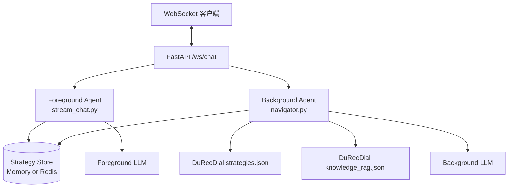
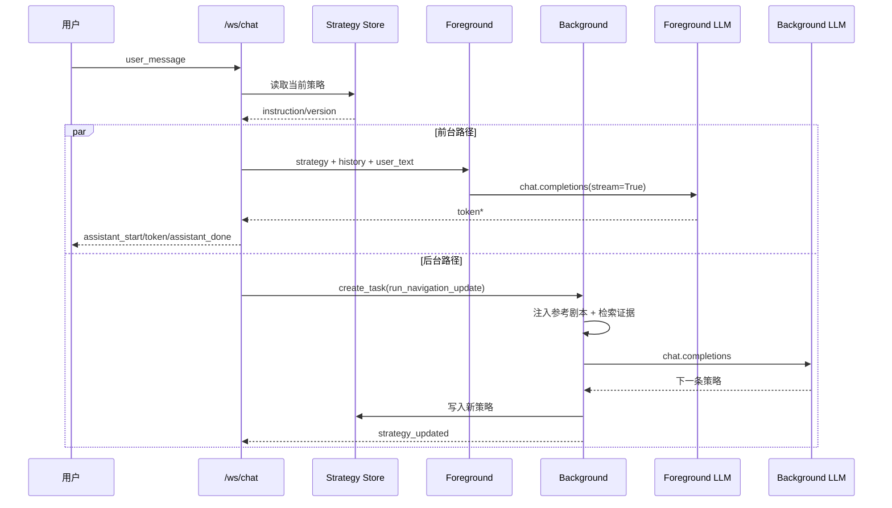

# tot_rec 架构文档

本文档描述当前系统的逻辑架构与数据流。实现细节与字段约定见 [`TECHNICAL.md`](TECHNICAL.md)。

---

## 1. 目标与分层

| 层 | 职责 | 当前状态 |
|----|------|----------|
| 前台执行层 | 流式生成用户可见回复 | 已实现 |
| 后台导航层 | 并行推演并写入下一条策略 | 已实现 |
| 知识增强层 | DuRecDial 参考剧本 + RAG 证据注入后台 | 已实现（阶段 A+B） |
| 状态层 | 会话策略缓存（内存/Redis） | 已实现 |

---

## 2. 总览架构

---

## 3. 单轮数据流

关键特性：

- 前后台并行执行，前台优先保证响应速度。
- 策略天然“滞后一回合”，这是设计选择而非异常。
- `strategy_updated` 事件由服务端发送，终端客户端可选择展示或忽略。

---

## 4. 知识增强架构（DuRecDial A+B）

### 4.1 阶段 A：参考剧本

- 数据：`strategies.json`
- 模块：`app/knowledge/strategies_store.py`
- 作用：按当前会话匹配一条最相关剧本，生成 `【DuRecDial 参考剧本】`。

### 4.2 阶段 B：RAG 检索

- 数据：`knowledge_rag.jsonl`
- 模块：`app/knowledge/retriever.py`
- 算法：内存索引 + BM25 排序 + top-k 截断
- 作用：生成 `【DuRecDial 检索证据】` 注入后台导航 prompt。

### 4.3 启动预热

- `app/main.py` 在 startup 事件中调用 `warmup_retriever()`
- 目的：降低首次请求读取大文件的延迟抖动。

---

## 5. 状态与一致性

- 会话键：`strategy:{session_id}`
- 内容：`instruction`、`version`、`updated_at`
- 存储：
  - 无 `REDIS_URL`：进程内内存（适合单机开发）
  - 有 `REDIS_URL`：Redis（适合多实例）

一致性语义：

- 前台读取“当前策略”，后台异步写“下一策略”。
- 允许短暂旧值读取，但策略会在后续轮次收敛。

---

## 6. 组件边界

- `app/main.py`：协议层（HTTP/WS）、并发编排、错误处理
- `app/foreground/stream_chat.py`：前台对话生成
- `app/background/navigator.py`：后台策略生成
- `app/knowledge/*`：知识加载、匹配、检索
- `app/state/strategy_store.py`：会话策略持久化

这个边界支持后续替换内部实现（例如把 BM25 换向量检索、把后台单次补全升级为多节点流程），而不改 WebSocket 契约。

---

## 7. 演进方向（可选）

- 前台也注入 RAG 证据（当前仅后台注入）
- 增加结构化可观测日志（session_id、模型、耗时、token）
- 引入更强后台编排（任务队列或图编排）以支撑复杂 ToT
- 为检索层增加向量索引与混合召回
