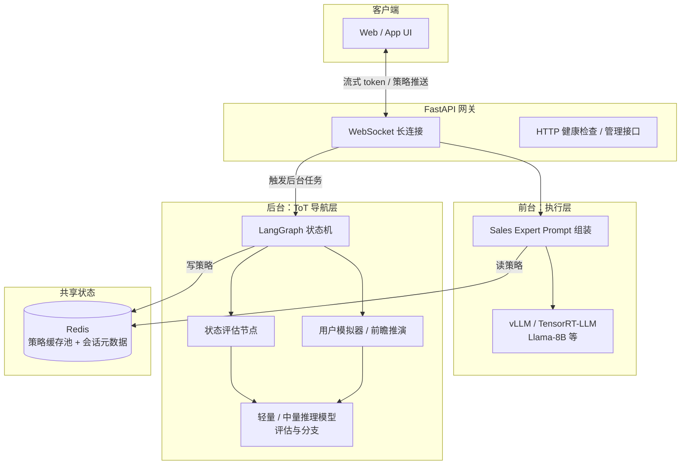
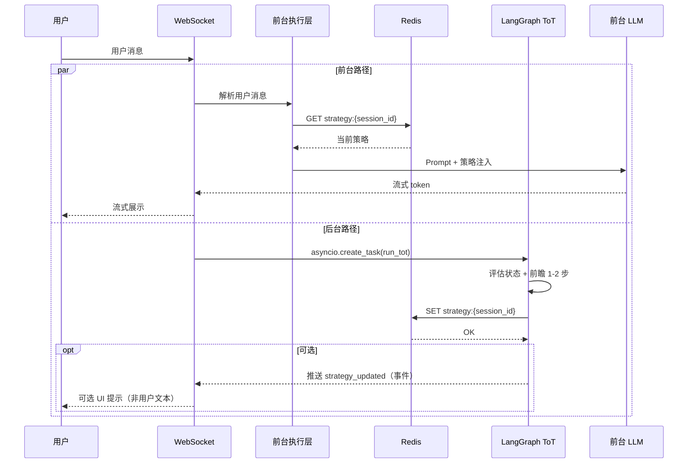
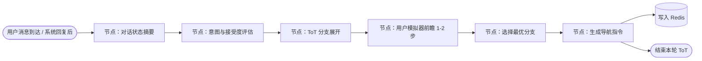
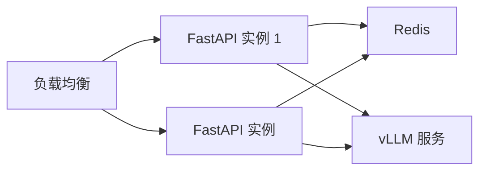

# 异步双轨推荐系统 — 系统架构

本文档描述「前台快销执行层 + 后台 ToT 导航层」的端到端架构，以及动态导航信标、技术栈选型与数据流。

**与实现对齐的说明（目录、配置、接口、并发）**：见 **[TECHNICAL.md](TECHNICAL.md)**。

---

## 1. 设计目标

| 层级 | 职责 | 目标 |
|------|------|------|
| **前台（执行层）** | 基于上下文 + 最新策略指令生成回复 | 低延迟、流式输出、人设一致 |
| **后台（导航层）** | 状态评估、前瞻模拟、ToT 决策 | 不生成用户可见文本，只产出**导航指令** |
| **连接层** | 策略共享与注入 | 前台无感知读取策略缓存，后台异步写入 |

---

## 2. 逻辑架构（总览）

---

## 3. 三层职责划分

### 3.1 前台：执行层

- **输入**：`conversation_history`（截断/摘要后的上下文）、`strategy_injection`（来自 Redis 的当前导航信标）、`persona`（销售专家人设）。
- **行为**：用户消息到达后**不等待** ToT 完成；立即用当前缓存中的策略（若存在）生成回复；可流式返回。
- **模型**：经微调的轻量模型（如 Llama-8B），由 **vLLM** 或 **TensorRT-LLM** 提供 **Continuous Batching**，保证吞吐与延迟。

### 3.2 后台：异步反思与导航层

- **触发**（与前台并行）：
  - **T1**：系统回复发出后，用户阅读/输入的间隙，后台持续或周期性刷新策略。
  - **T2**：用户新消息到达时，与前台生成**并行**启动新一轮 ToT（评估上一步是否合适、下一步话题方向）。
- **输出**：仅**一条简短系统指令**（自然语言或结构化 JSON），例如「当前策略：……」，写入 Redis，**不**直接拼进用户可见回复（由前台决定是否注入 Prompt）。

### 3.3 动态导航信标（策略共享池）

- **介质**：Redis（键值 + 可选 TTL，按 `session_id` 隔离）。
- **语义**：「当前最优话题方向 / 约束」，供前台组装 System 或 User 侧注入块。
- **一致性**：允许短暂滞后（前台可能先读到上一轮策略）；新策略写入后，下一轮用户或助手轮次即可生效。

---

## 4. 数据流：单轮对话

---

## 5. Redis 键空间设计（建议）

| 键模式 | 类型 | 内容 |
|--------|------|------|
| `strategy:{session_id}` | String 或 Hash | `instruction`（导航指令）、`version`（单调递增）、`ttl_hint` 等 |
| `session:{session_id}:meta` | Hash | `user_id`、`created_at`、`last_turn` |
| `lock:{session_id}:tot` | String | 可选，后台 ToT 互斥，避免重复重入 |

**策略 JSON 示例（Hash 字段）**：`instruction`、`confidence`、`branch_tags[]`、`updated_at`。

---

## 6. LangGraph：后台 ToT 编排（概念图）

- **状态**：LangGraph 的 `graph state` 中保留 `messages`、`eval_scores`、`candidate_branches`、`chosen_instruction`。
- **与用户模拟器**：在 `S3-S4` 用轻量模型快速生成若干「假设用户回应」，再打分，避免全量对话生成。

---

## 7. FastAPI 与并发模型

- **WebSocket**：每个会话一个连接；`receive` 用户消息与 `send` 流式 token 分离协程或使用队列。
- **前台**：`async` 调用 vLLM 的 OpenAI 兼容接口（流式 `chat.completions`）。
- **后台**：`asyncio.create_task` 或 **任务队列**（如后续扩展 Celery/Arq）挂载 ToT；同一 `session_id` 可串行或带版本号合并，避免乱序覆盖。

---

## 8. 技术栈映射

| 维度 | 选型 | 在本架构中的角色 |
|------|------|------------------|
| 推理引擎 | vLLM / TensorRT-LLM | 前台主模型高吞吐、流式；可选后台小模型 |
| 后端框架 | FastAPI | WebSocket + asyncio + 依赖注入 |
| 状态存储 | Redis | 策略缓存池、会话元数据、可选分布式锁 |
| 后台编排 | LangGraph | ToT 循环、反思、状态机 |
| 通信协议 | WebSocket | 长连接、流式 token、可选服务端推送策略更新事件 |

---

## 9. 部署拓扑（建议）

- **有状态会话**：WebSocket 需 sticky session，或会话状态只放 Redis、任意 API 节点可恢复。
- **vLLM**：独立进程，与 API 进程分离，便于横向扩展。

---

## 10. 与本仓库的对应关系（后续实现）

| 目录/文件（建议） | 说明 |
|-------------------|------|
| `main.py` | FastAPI 入口、WebSocket 路由 |
| `foreground/` | Prompt 组装、前台 LLM 客户端 |
| `background/` | LangGraph graph 定义、ToT 节点 |
| `state/redis_store.py` | Redis 策略读写 |
| `schemas/` | 策略指令、会话事件的 Pydantic 模型 |

---

## 11. 小结

- **前台**只负责「快」与「像人」，**策略**来自 Redis，不依赖 ToT 当轮完成。
- **后台**负责「慢思考」与「导航」，产出**短指令**写入 Redis，必要时通过 WebSocket 推送**事件**（非聊天内容）。
- **动态导航信标**是前后台契约：版本号 + 会话隔离，便于演进与调试。

如需下一步，可在本仓库中实现最小闭环：单会话 WebSocket + Redis 策略读写 + 模拟 ToT 写指令 + 前台注入 Prompt。
